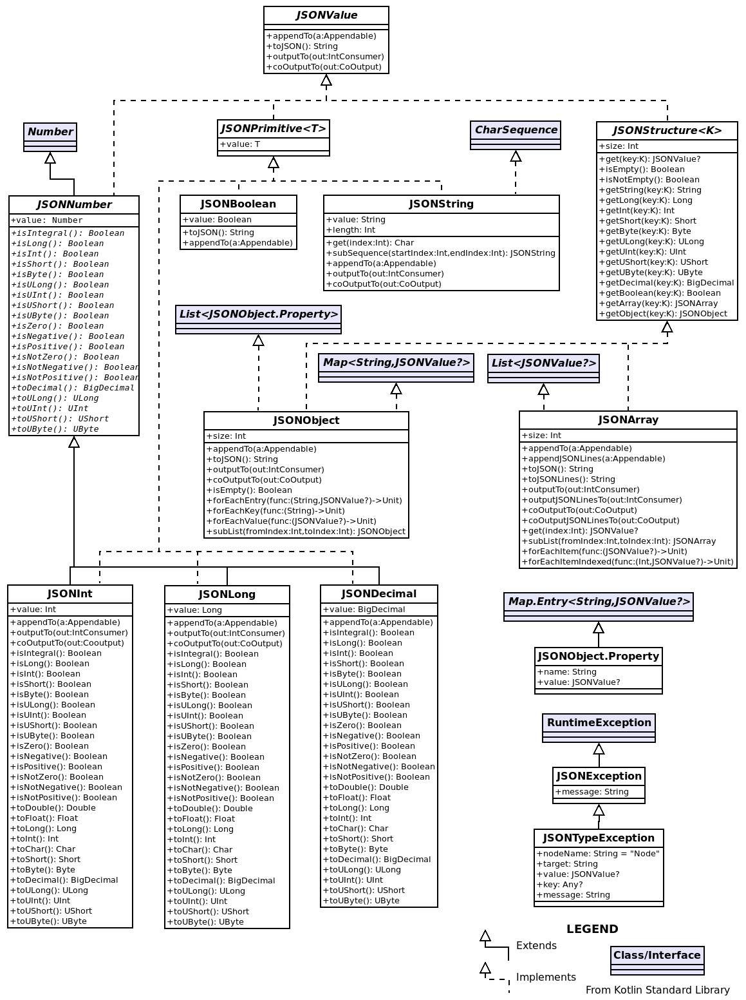

# kjson-core

[](https://app.travis-ci.com/github/pwall567/kjson-core)
[](https://opensource.org/licenses/MIT)
[](https://github.com/JetBrains/kotlin/releases/tag/v1.6.10)
[](https://search.maven.org/search?q=g:%22io.kjson%22%20AND%20a:%kjson-core%22)

JSON Kotlin core library

## Background

The input of JSON data generally consists of two main phases &ndash; parsing the input text and converting the
human-readable form into an easily navigated internal representation, and then mapping that internal form into
pre-existing data types.
Output may similarly use an intermediate form, but it is on the input side that the converted form is most useful
&ndash; it allows, for example, all of the properties of an object to be analysed before the determination of the
appropriate representation for the object.

There are also many types of JSON processing functions that do not require mapping to a target class &ndash; they simply
require an internal representation of the JSON data.

The `kjson-core` library provides the basic functionality required to represent JSON values in Kotlin, including:
- parsing functions to convert JSON text to a structure of JSON values
- classes to hold the internal forms of the values
- output functions to create valid JSON representations from the internal form

The library is an evolution of the [jsonutil](https://github.com/pwall567/jsonutil) Java library; it makes better use of
Kotlin-specific functionality like controlled nullability.

## User Guide

All JSON values are represented by Kotlin objects of type `JSONValue?` &ndash; that is, they are all instances of
classes that implement the `JSONValue` interface, or in the case of the JSON "`null`" value they are `null`.

### `JSONValue`

The `JSONValue` interface specifies four functions:
- `appendTo()` &ndash; this appends the JSON text form of the object to a specified `Appendable` (when outputting
  JSON, it is more efficient to append to a single `Appendable`, as opposed to creating strings for each element)
- `toJSON()` &ndash; this outputs the value in syntactically-correct JSON (a default implementation makes use of the
  above `appendTo()` function)
- `output()` &ndash; this outputs the JSON text form of the object using an `IntConsumer` (similar to `appendTo()`, but
  allowing a greater choice of output mechanism)
- `coOutput()` (suspend function) &ndash; non-blocking version of `output()`, suitable for use in a coroutine-based
  environment

`JSONValue` is a sealed interface and the implementing classes are limited to:
- [`JSONString`](#jsonstring) &ndash; a string value
- [`JSONInt`](#jsonint) &ndash; a number value that fits in a 32-bit signed integer
- [`JSONLong`](#jsonlong) &ndash; a number value that fits in a 64-bit signed integer
- [`JSONDecimal`](#jsondecimal) &ndash; any number value, including non-integer (uses `BigDecimal` internally)
- [`JSONBoolean`](#jsonboolean) &ndash; a boolean value
- [`JSONArray`](#jsonarray) &ndash; an array
- [`JSONObject`](#jsonobject) &ndash; an object

The implementing classes are all immutable.

### `JSONPrimitive`

`JSONPrimitive` is a sealed interface (and a sub-interface of [`JSONValue`](#jsonvalue)) implemented by the classes for
primitive values, _i.e._ [`JSONInt`](#jsonint), [`JSONLong`](#jsonlong), [`JSONDecimal`](#jsondecimal),
[`JSONString`](#jsonstring) and [`JSONBoolean`](#jsonboolean).
It is a parameterised interface, where the parameter is the type of the value.
The interface specifies a single value (named `value`), of the parameter type.
The value is never `null`.

### `JSONNumber`

In addition to implementing [`JSONPrimitive`](#jsonprimitive), the number value classes [`JSONInt`](#jsonint),
[`JSONLong`](#jsonlong) and [`JSONDecimal`](#jsondecimal) all derive from the sealed class `JSONNumber`, which itself
derives from the system class `Number`.
This means that these classes may be used without conversion anywhere a `Number` is called for.

The `Number` class provides a set of `toInt()`, `toLong()` _etc._ functions, to which `JSONNumber` adds the following:

| Function      | Converts the value to... |
|---------------|--------------------------|
| `toDecimal()` | `BigDecimal`             |
| `toULong()`   | `ULong`                  |
| `toUInt()`    | `UInt`                   |
| `toUShort()`  | `UShort`                 |
| `toUByte()`   | `UByte`                  |

`JSONNumber` also provides the following boolean functions:

| Function          | Returns `true` iff...                                            |
|-------------------|------------------------------------------------------------------|
| `isIntegral()`    | the value has no fractional part, or the fractional part is zero |
| `isLong()`        | the value may be converted to `Long` with no loss of precision   |
| `isInt()`         | the value may be converted to `Int` with no loss of precision    |
| `isShort()`       | the value may be converted to `Short` with no loss of precision  |
| `isByte()`        | the value may be converted to `Byte` with no loss of precision   |
| `isULong()`       | the value may be converted to `ULong` with no loss of precision  |
| `isUInt()`        | the value may be converted to `UInt` with no loss of precision   |
| `isUShort()`      | the value may be converted to `UShort` with no loss of precision |
| `isUByte()`       | the value may be converted to `UByte` with no loss of precision  |
| `isZero()`        | the value is equal to 0                                          |
| `isNegative()`    | the value is less than 0                                         |
| `isPositive()`    | the value is greater than 0                                      |
| `isNotZero()`     | the value is not equal to 0                                      |
| `isNotNegative()` | the value is greater than or equal to 0                          |
| `isNotPositive()` | the value is less than or equal to 0                             |

The `JSONNumber` classes also override `equals()` (and `hashCode()`) so that instances with the same value but different
types will be regarded as equal.
`JSONInt(27)`, `JSONLong(27)` and `JSONDecimal(27)` will all be considered equal, and will all return the same hash
code.

### `JSONInt`

The `JSONInt` class holds JSON number values that fit in a 32-bit signed integer.
The class derives from [`JSONNumber`](#jsonnumber), providing implementations for all the abstract functions of that
class, and it also implements [`JSONPrimitive`](#jsonprimitive) with the parameter type `Int`.

The `Int` value may be accessed by the property `value`.

### `JSONLong`

The `JSONLong` class holds JSON number values that will fit in a 64-bit signed long integer.
The class derives from [`JSONNumber`](#jsonnumber), providing implementations for all the abstract functions of that
class, and it also implements [`JSONPrimitive`](#jsonprimitive) with the parameter type `Long`.

The `Long` value may be accessed by the property `value`.

### `JSONDecimal`

The `JSONDecimal` class holds any JSON number values, including non-integer values.
The class derives from [`JSONNumber`](#jsonnumber), providing implementations for all the abstract functions of that
class, and it also implements [`JSONPrimitive`](#jsonprimitive) with the parameter type `BigDecimal`.

The `BigDecimal` value may be accessed by the property `value`.

### `JSONString`

The `JSONString` class holds a JSON string value.
The class implements [`JSONPrimitive`](#jsonprimitive) with the parameter type `String`.

The parser converts JSON escape sequences on input, and the `appendJSON()` and `toJSON()` functions convert non-ASCII
characters to escape sequences on output.

The `String` value may be accessed by the property `value` (which will never be `null`).

`JSONString` also implements the `CharSequence` interface, which allows access to all the functionality of that
interface without having to extract the `value` property.
The `subSequence()` function will return a new `JSONString`.

### `JSONBoolean`

`JSONBoolean` is an `enum class` with two members &ndash; `TRUE` and `FALSE`.
The class implements [`JSONPrimitive`](#jsonprimitive) with the parameter type `Boolean`.

The `Boolean` value may be accessed by the property `value`.

### `JSONStructure`

`JSONStructure` is a sealed interface (another sub-interface of [`JSONValue`](#jsonvalue)) implemented by the classes
for structured types, that is, arrays and objects.
It specifies a single value `size` (`Int`) which gives the number of entries in the array or object, and the functions
`isEmpty()` and `isNotEmpty()` which (unsurprisingly) return `true` or `false` respectively if the structure is empty.

It also provides convenience functions to both get a member of the structure and convert it to the required type (`K` is
`Int` for `JSONArray` or `String` for `JSONObject`):

| Function        | Converts the value to... |
|-----------------|--------------------------|
| `getString(K)`  | `String`                 |
| `getLong(K)`    | `Long`                   |
| `getInt(K)`     | `Int`                    |
| `getShort(K)`   | `Short`                  |
| `getByte(K)`    | `Byte`                   |
| `getULong(K)`   | `ULong`                  |
| `getUInt(K)`    | `UInt`                   |
| `getUShort(K)`  | `UShort`                 |
| `getUByte(K)`   | `UByte`                  |
| `getDecimal(K)` | `BigDecimal`             |
| `getBoolean(K)` | `Boolean`                |
| `getArray(K)`   | `JSONArray`              |
| `getObject(K)`  | `JSONObject`             |

These have the advantage over, for example, `json["property"].asString`, that the error message in the event of an
incorrect type includes the key or index used to select the item.

### `JSONArray`

The `JSONArray` class implements the `List<JSONValue?>` interface, and all the functions of that interface are available
to navigate the array (indexing via `array[n]`, `contains(obj)`, `iterator()` _etc._).
The `subList()` function will return a new `JSONArray`.

The class also implements the [`JSONStructure`](#jsonstructure) interface.

The constructor for `JSONArray` is not publicly accessible, but an `of()` function is available in the
`companion object`, and a `build` function and the `Builder` nested class allow arrays to be constructed dynamically.

`JSONArray` implements the `equals()` and `hashCode()` functions as specified for the Java Collections classes, so that
an instance of `JSONArray` may be compared safely with an instance of any class correctly implementing
`List<JSONValue?>`.

### `JSONObject`

The `JSONObject` class implements the `Map<String, JSONValue?>` interface, and all the functions of that interface are
available to navigate the object (retrieval via `array["name"]`, `containsKey("name")`, `entries` _etc._).
The class also implements the [`JSONStructure`](#jsonstructure) interface.

The original order of the input is maintained on parsing or on the programmatic creation of a `JSONObject`.

The constructor for `JSONObject` is not publicly accessible, but an `of()` function is available in the
`companion object`, and a `build` function and the `Builder` nested class allow objects to be constructed dynamically.

`JSONObject` implements the `equals()` and `hashCode()` functions as specified for the Java Collections classes, so that
an instance of `JSONObject` may be compared safely with an instance of any class correctly implementing
`Map<String, JSONValue?>`.

### `JSON`

The `JSON` object contains a number of functions to assist with parsing and object creation.

#### Parsing Functions

The simplest way to parse JSON text is:
```kotlin
        val json = JSON.parse(text)
```

The result will be of type `JSONValue?` &ndash; it will be `null` if the text consists of just the string "`null`" (with
possible leading and trailing whitespace).

If only non-null JSON values are expected:
```kotlin
        val json = JSON.parseNonNull(text)
```
The result of this function will be of type `JSONValue` (no question mark) and an exception will be thrown if the JSON
was "`null`".

If the JSON is expected to be an object (and it is an error if it is not):
```kotlin
        val json = JSON.parseObject(text)
```
In this case the result will be of type `JSONObject`, and an exception will be thrown if it is not an object.

Similarly, if the JSON is expected to be an array:
```kotlin
        val json = JSON.parseArray(text)
```
The result type will be `JSONArray`, and again, an exception will be thrown if the input is not of the correct type.

#### `JSONValue` Creation Functions

The `JSON` object also provides a number of shortcut functions to create `JSONValue`s:

| Function                                   | Creates       |
|--------------------------------------------|---------------|
| `JSON.of(Int)`                             | `JSONInt`     |
| `JSON.of(Long)`                            | `JSONLong`    |
| `JSON.of(BigDecimal)`                      | `JSONDecimal` |
| `JSON.of(String)`                          | `JSONString`  |
| `JSON.of(Boolean)`                         | `JSONBoolean` |
| `JSON.of(vararg JSONValue?)`               | `JSONArray`   |
| `JSON.of(vararg Pair<String, JSONValue?>)` | `JSONObject`  |

#### Human-Friendly Output

To simplify error reporting, the `JSON` object provides a `displayValue()` extension function on `JSONValue?` to create
an abbreviated form of the value suitable for error messages.
Arrays with more than one item are displayed as `[ ... ]`, objects with more than one element are displayed as
`{ ... }`, and long strings are shortened with "` ... `" in the middle.

For example:
```kotlin
     JSONString("the quick brown fox jumps over the lazy dog").displayValue()
```
will display:
```
"the quic ... lazy dog"
```
The maximum number of characters to display in a string defaults to 21, but may be specified as a parameter, _e.g._
`displayValue(17)` (odd numbers are best, because they result in the same number of characters before and after the
elision).

#### Security-Aware Output

There is often a requirement to log JSON inputs for later error diagnosis, with the restriction that logs must not
contain sensitive information.
The `elidedValue()` extension function on `JSONValue?` allows JSON values to be converted to the text form with certain
nominated elements excluded.

For example:
```kotlin
    val json = JSON.parse("""{"name":"Adam","accountNo":"12345678"}""")
    json.elidedValue(exclude = setOf("accountNo"))
```
will display:
```
{"name":"Adam","accountNo":"****"}
```
All elements with the specified name will be elided, wherever they occur in the object tree.

The elements to be elided may be specified as a `Collection` of element names to be excluded as shown above, or (less
usefully) as a `Collection` of element names to be included (using the `include` parameter).
The substitute string (default "`****`") may also be specified using the `substitute` parameter.

#### Extension Values

To simplify casting a `JSONValue` to the expected type, the `JSON` object provides extension values on `JSONValue?`:

| Value                        | Result type   | If the value is not of that type... |
|------------------------------|---------------|-------------------------------------|
| `JSONValue?.asString`        | `String`      | throw exception                     |
| `JSONValue?.asStringOrNull`  | `String?`     | return `null`                       |
| `JSONValue?.asLong`          | `Long`        | throw exception                     |
| `JSONValue?.asLongOrNull`    | `Long?`       | return `null`                       |
| `JSONValue?.asInt`           | `Int`         | throw exception                     |
| `JSONValue?.asIntOrNull`     | `Int?`        | return `null`                       |
| `JSONValue?.asShort`         | `Short`       | throw exception                     |
| `JSONValue?.asShortOrNull`   | `Short?`      | return `null`                       |
| `JSONValue?.asByte`          | `Byte`        | throw exception                     |
| `JSONValue?.asByteOrNull`    | `Byte?`       | return `null`                       |
| `JSONValue?.asULong`         | `ULong`       | throw exception                     |
| `JSONValue?.asULongOrNull`   | `ULong?`      | return `null`                       |
| `JSONValue?.asUInt`          | `UInt`        | throw exception                     |
| `JSONValue?.asUIntOrNull`    | `UInt?`       | return `null`                       |
| `JSONValue?.asUShort`        | `UShort`      | throw exception                     |
| `JSONValue?.asUShortOrNull`  | `UShort?`     | return `null`                       |
| `JSONValue?.asUByte`         | `UByte`       | throw exception                     |
| `JSONValue?.asUByteOrNull`   | `UByte?`      | return `null`                       |
| `JSONValue?.asDecimal`       | `BigDecimal`  | throw exception                     |
| `JSONValue?.asDecimalOrNull` | `BigDecimal?` | return `null`                       |
| `JSONValue?.asBoolean`       | `Boolean`     | throw exception                     |
| `JSONValue?.asBooleanOrNull` | `Boolean?`    | return `null`                       |
| `JSONValue?.asArray`         | `JSONArray`   | throw exception                     |
| `JSONValue?.asArrayOrNull`   | `JSONArray?`  | return `null`                       |
| `JSONValue?.asObject`        | `JSONObject`  | throw exception                     |
| `JSONValue?.asObjectOrNull`  | `JSONObject?` | return `null`                       |

## Lenient Parsing

The parser will by default apply strict validation to the JSON input, and in some cases this may be unhelpful.
There is occasionally a need to parse JSON that is not correctly formatted according to the specification, and to
accommodate this requirement, the parser may be supplied with a `ParseOptions` object containing option settings for
parser leniency.
For example:
```kotlin
    val options = ParseOptions(
        objectKeyDuplicate = ParseOptions.DuplicateKeyOption.ERROR,
        objectKeyUnquoted = false,
        objectTrailingComma = false,
        arrayTrailingComma = false,
    )
    val jsonValue = Parser.parse(jsonString, options)
```

Note that in order to use this functionality, the `Parser` must be called directly;
the helper functions in the `JSON` object do not include this capability.

### `objectKeyDuplicate`

The JSON specification states that a given key **SHOULD** appear only once in an object, but some software may output
objects with the same key repeated multiple times.
Under normal circumstances, the parser will throw an exception when it encounters a second occurrence of the same key,
but if such data is required to be accepted, the `objectKeyDuplicate` options setting may be used to specify the desired
behaviour.

The field is an `enum` (`DuplicateKeyOption`), and the possible values are:

- `ERROR`: treat the duplicate key as an error (this is the default)
- `TAKE_FIRST`: take the value of the first occurrence and ignore duplicates
- `TAKE_LAST`: take only the last occurrence and ignore any preceding occurrences
- `CHECK_IDENTICAL`: ignore duplicates only if they are identical to the original value, otherwise report an error

### `objectKeyUnquoted`

Unlike JavaScript, on which it is based, JSON requires that object keys be enclosed in quotes.
Sometimes, particularly when parsing human-edited JSON, it can be a helpful to allow keys to be conventional computer
language identifiers, and this can be selected by the `objectKeyUnquoted` option.

Setting this flag to `true` will cause the parser to allow object keys to be specified without quotes.
When using this option, the keys must follow this pattern:

- the first character must be ASCII alphabetic (upper or lower case) or underscore
- subsequent characters must be ASCII alphabetic (upper or lower case) or numeric or underscore

### `objectTrailingComma`

When outputting the members of an object, it can be simpler to add a comma after each member, regardless of whether it
is the last one.
To allow trailing commas in objects, the option `objectTrailingComma` can be set to `true`.

### `arrayTrailingComma`

Similarly, when outputting the items of an array, it can be simpler to add a comma after each item.
To allow trailing commas in arrays, the option `arrayTrailingComma` can be set to `true`.

## Class Diagram

This class diagram may help to explain the main classes and interfaces and the relationships between them.



The diagram was produced by [Dia](https://wiki.gnome.org/Apps/Dia/); the diagram file is at [diagram.dia](diagram.dia).

## Dependency Specification

The latest version of the library is 5.0, and it may be obtained from the Maven Central repository.

### Maven
```xml
    <dependency>
      <groupId>io.kjson</groupId>
      <artifactId>kjson-core</artifactId>
      <version>5.0</version>
    </dependency>
```
### Gradle
```groovy
    implementation "io.kjson:kjson-core:5.0"
```
### Gradle (kts)
```kotlin
    implementation("io.kjson:kjson-core:5.0")
```

Peter Wall

2022-11-27
